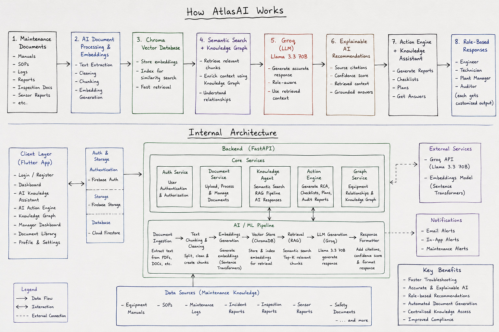

# AtlasAI × SigNoz

**Agents of SigNoz — WeMakeDevs Hackathon 2026 · Track 03: Build Your Own**

### Making a Multi-Agent Industrial Assistant Fully Debuggable

> "If you can't observe your AI agents, you don't own them."

AtlasAI is an AI-powered industrial maintenance assistant — engineers, technicians, plant managers, and auditors ask it plain-language questions and get sourced answers pulled from their team's own manuals, SOPs, and logs via Retrieval-Augmented Generation. It was originally built for the ET AI Hackathon 2026.

For **Agents of SigNoz**, we instrumented the whole thing with OpenTelemetry and wired it into a self-hosted SigNoz stack, so every request — every agent invocation, every retrieval hop, every LLM call — is fully traceable instead of a black box.

---

## Try It

**App:** [Download / open the AtlasAI app](https://drive.google.com/file/d/1ZdDgrQgCD-Nn1dSDNyetgU0NA_dh2eAS/view?usp=sharing)

**Backend API:** [https://ethack-genai.onrender.com/](https://ethack-genai.onrender.com/)

The backend is hosted on Render's free tier, so the first request after a period of inactivity can take 30-60 seconds to wake the service up. Requests after that are fast. If you're demoing this live, hit `GET /ping` a minute beforehand to warm it up.

> 📹 *Add demo video link here before submitting.*
> 📊 *Add SigNoz dashboard screenshots / recording here before submitting.*
> ✍️ *Add mandatory project blog link here before submitting.*

---

## Why We Built This (Twice)

The first problem AtlasAI solves: industrial teams drown in documentation, and finding the right answer during an actual equipment failure is slow and error-prone.

The second problem — the one this hackathon is about — is that once you've got a multi-agent RAG system in production, *it* becomes its own black box. Which agent got picked for a given question? Was the answer slow because retrieval was slow, or because Groq was slow? Is OCR quietly failing on half your scanned PDFs? Without observability, none of that is answerable — you're debugging a system that reasons on its own by guessing.

SigNoz gives us that visibility: one platform for traces, metrics, and logs across every hop the system makes, correlated so a slow answer or a wrong one can be traced back to its actual cause.

---

## What It Does

**Knowledge Assistant**
Ask questions in plain language and get answers grounded in your uploaded maintenance documents, with equipment-aware search and source citations for every response.

**Retrieval-Augmented Generation**
Answers are built only from what's actually in your documents. If the answer isn't in there, AtlasAI says so instead of making something up.

**AI Action Engine**
Generates maintenance documents on demand: Root Cause Analysis reports, maintenance checklists, inspection reports, preventive maintenance plans, corrective action reports, and audit reports.

**Role-Based Responses**
The same question gets answered differently depending on who's asking — Engineer, Technician, Plant Manager, or Auditor.

**Full Observability (new)**
Every one of the above is now traced end-to-end in SigNoz — see [How the Agents Actually Work](#how-the-agents-actually-work) below.

---

## Architecture



Three main pieces: a Flutter client, a FastAPI backend running five core services (Auth, Document, Knowledge Agent, Action Engine, Graph), and an AI/ML pipeline handling ingestion, chunking, embedding, vector storage, retrieval, and generation. External services are Groq (LLM) and a sentence-transformers embedding model. Sitting alongside all of it now: a self-hosted SigNoz stack receiving OTLP telemetry from the backend.

## How the Agents Actually Work

The orchestrator (`app/orchestrator.py`) routes each query to one of five agents:

| Agent | Role |
|---|---|
| `knowledge_agent` | The only one that LLM-synthesizes an answer (Groq / Llama 3.3 70B), grounded in Chroma retrieval |
| `maintenance_agent` | Failure / RCA-keyword routing |
| `compliance_agent` | Audit / regulation-keyword routing |
| `lessons_learned_agent` | Matches new incidents against historical ones |
| `knowledge_capture_agent` | Guided interview capture flow for tribal knowledge |

OCR isn't a separate agent — it's a fallback path inside `app/services/ingestion.py::extract_pages()`, used per-page only when the PDF's text layer comes back empty.

A judge asking "what happens when I ask a question" gets exactly this trace tree in SigNoz:

```text
POST /query
 └─ agent.knowledge_agent
     └─ retrieval.retrieve
         └─ chroma.query
     └─ groq.chat_completion
         └─ POST api.groq.com/... (auto-instrumented httpx span)
```

---

## SigNoz Integration

### What's instrumented

| Layer | File | What SigNoz sees |
|---|---|---|
| Every HTTP request | `app/main.py` | Root trace per `/query`, `/ingest`, `/actions/generate`, etc. |
| Each agent | `app/orchestrator.py` | `agent.<name>` span per invocation, tagged with outcome (ok/error) and confidence |
| Retrieval | `app/services/retrieval.py` | `retrieval.retrieve` span wrapping a `chroma.query` child span |
| Embeddings | `app/services/embeddings.py` | `embeddings.encode` span, batch size |
| LLM calls | `app/services/groq_client.py` | `groq.chat_completion` span (model, tokens, temperature) + auto-traced outbound HTTP |
| OCR / ingestion | `app/services/ingestion.py` | Per-page span tagged `text_layer` or `ocr_fallback`, failures counted separately |
| Logs | `app/telemetry.py` | App logs correlated with trace/span IDs |

### Metrics (`app/otel_metrics.py`)

- `atlasai.agent.duration_ms`, `atlasai.agent.requests_total` (by agent, outcome)
- `atlasai.retrieval.duration_ms`, `atlasai.chroma.query_duration_ms`
- `atlasai.embedding.duration_ms`, `atlasai.embedding.batch_size`
- `atlasai.llm.duration_ms`, `atlasai.llm.tokens_total` (by kind), `atlasai.llm.failures_total`
- `atlasai.ocr.page_duration_ms`, `atlasai.ocr.pages_total` (by method), `atlasai.ocr.failures_total`

### Dashboards (built in the SigNoz UI)

1. **Request Overview** — p50/p95/p99 latency & error rate on FastAPI auto-instrumented spans, by route
2. **Agent Dashboard ⭐** — per-agent latency, success rate, and call volume across all five agents
3. **RAG Pipeline** — retrieval, Chroma query, and embedding latency; queries/sec
4. **LLM** — latency, token usage over time, failure count
5. **OCR / Ingestion** — OCR fallback rate, per-page duration, failure count

See [`docs/DASHBOARDS.md`](docs/DASHBOARDS.md) for the exact panel-by-panel query builder setup.

### Alerts

- Retrieval p95 > 3s (Warning)
- Groq LLM p95 > 5s (Warning)
- Any agent error rate > 0 over 5 min (Critical)
- *(optional)* OCR failure rate > 10% over 15 min

### MCP Server

`casting.yaml` deploys the SigNoz MCP server alongside the main stack at `localhost:8000`, covering the SigNoz MCP integration scoring point on the infra side.

---

## 🛠️ Tech Stack

### 🎨 Frontend

 Flutter &nbsp;
 Dart &nbsp;
 Firebase Authentication &nbsp;
 Cloud Firestore &nbsp;
 Firebase Storage

### ⚙️ Backend

 FastAPI &nbsp;
 Python

### 🤖 AI / ML

🦙 Groq (Llama 3.3 70B) &nbsp;
🔍 Retrieval-Augmented Generation (RAG) &nbsp;
💾 ChromaDB &nbsp;
🤗 Sentence Transformers &nbsp;
🧠 Knowledge Graph

### 🗄️ Database

 Firestore &nbsp;
💾 Chroma Vector Database

### 📡 Observability

🔭 OpenTelemetry (API, SDK, OTLP HTTP exporter) &nbsp;
📈 SigNoz (self-hosted via Foundry) &nbsp;
🏗️ Foundry (`foundryctl`) &nbsp;
🔌 SigNoz MCP Server

---

## Getting Started

### 1. Deploy SigNoz with Foundry

```bash
foundryctl gauge -f casting.yaml   # checks Docker + Compose plugin are present
foundryctl cast  -f casting.yaml   # generates pours/deployment/ and starts the stack
```

Confirm it's up: `docker compose -f pours/deployment/compose.yaml ps` should show every container `Up`, then open [http://localhost:8080](http://localhost:8080).

`cast` writes `casting.yaml.lock` automatically — both `casting.yaml` and `casting.yaml.lock` are committed to this repo per the hackathon's reproducibility requirement. Don't hand-edit either.

Full walkthrough: [`docs/FOUNDRY_DEPLOY.md`](docs/FOUNDRY_DEPLOY.md).

### 2. Backend

```bash
cd atlasai_backend
cp .env.example .env   # fill in GROQ_API_KEY, HF_API_TOKEN, CHROMA_HOST/PORT, FIREBASE_PROJECT_ID
docker compose up --build
```

Check it's running:

```bash
curl http://localhost:8000/ping
```

> Running with `uvicorn app.main:app` directly on the host instead? Leave `OTEL_EXPORTER_OTLP_ENDPOINT=http://localhost:4318` in `.env` as-is — no Docker networking workaround needed. Running the backend in its own container, as above? `docker-compose.yml` already routes to SigNoz's OTLP port on the host via `host.docker.internal:4318`.

### 3. Frontend

```bash
cd atlasai_app
flutter pub get
flutter run
```

### 4. Generate telemetry & build dashboards

Hit the backend a few times (upload a doc, ask a few questions across different agent types), then build the dashboards and alerts described above — see [`docs/DASHBOARDS.md`](docs/DASHBOARDS.md) for the exact query-builder steps.

---

## Where We'd Take This Next

- IoT sensor integration for real-time equipment data
- Predictive maintenance based on historical patterns
- Voice commands for hands-free field use
- ERP/SAP integration
- Smart notifications for anomalies and overdue maintenance
- Multi-language support for regional teams
- SigNoz-driven auto-scaling or auto-fallback (e.g. switch LLM providers on sustained Groq latency alerts)
- Cost dashboards correlating `atlasai.llm.tokens_total` with actual Groq spend

---

## AI Usage Disclosure

As permitted (and required to be declared) under the hackathon rules, we used **Claude** (Anthropic) during this build for:

- Debugging Docker/Apple Silicon dependency issues and a HuggingFace API deprecation during setup
- Reviewing and fixing a confidence-formula bug in the agent orchestrator
- Drafting the OpenTelemetry instrumentation approach (spans, metrics) and this README/documentation
- General code review and troubleshooting throughout the week

All core product logic, agent design, and SigNoz dashboard/alert configuration were built and verified by the team.

---

## Team

**Team GenAI**

| Role | Name | GitHub |
|------|------|--------|
| Team Lead | Sanika Deshmukh | [@sanikad20](https://github.com/sanikad20) |
| Team Member | Pragati Kharat | [@pragatikharat17](https://github.com/pragatikharat17) |
| Team Member | Divya Addagatla | [@adivya15](https://github.com/adivya15) |

---

If you found AtlasAI × SigNoz interesting, consider starring the repository.
